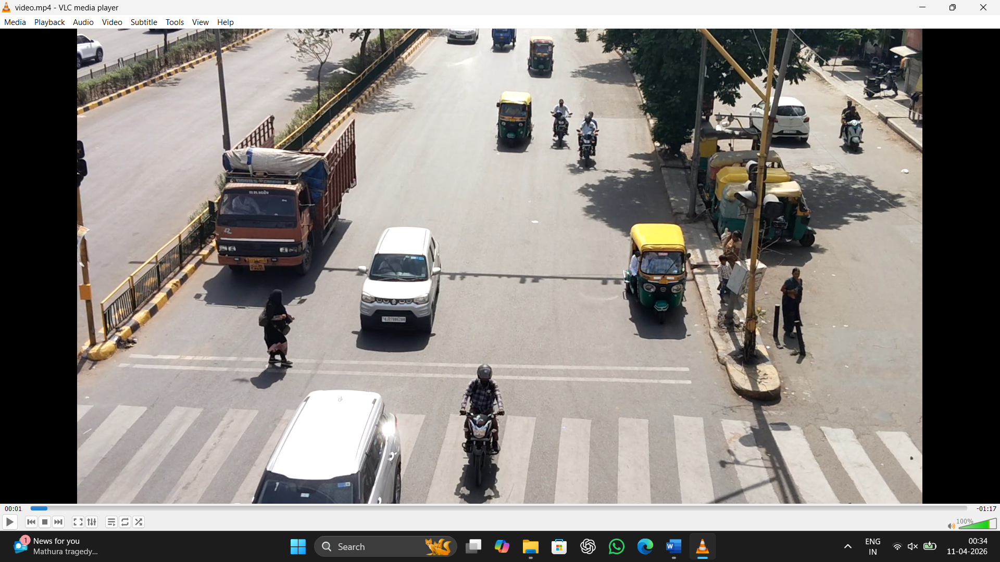
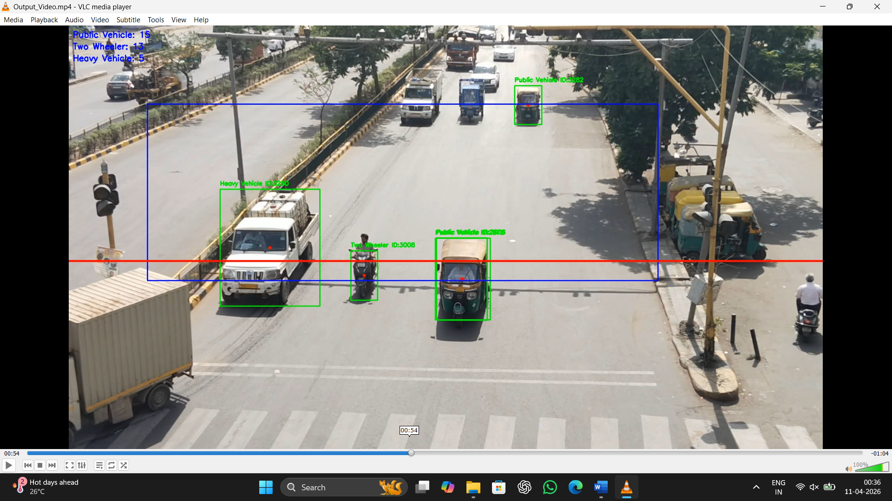

# 🚦 Traffic Surveillance System using Computer Vision

> Real-time vehicle detection, classification & counting on Indian traffic  
> using YOLOv8 + ByteTrack

---

## 📸 Project Demo

### Input — Raw Traffic Footage


### Output — After Detection & Tracking


> ✅ Green boxes = detected vehicles with unique IDs  
> 🔴 Red line = virtual counting line  
> 🔵 Blue box = Region of Interest (ROI)  
> 📊 Top-left = live category-wise count

---

## 📊 Sample Output Results

| Category | Count |
|---|---|
| 🚗 Public Vehicle | 15 |
| 🏍️ Two Wheeler | 13 |
| 🚛 Heavy Vehicle | 5 |
| **Total** | **33** |

---

## 📌 Problem Statement

Traditional CCTV systems double-count vehicles when they slow down or stop.  
This system assigns a **unique ID per vehicle** using ByteTrack, ensuring  
each vehicle is counted **exactly once** regardless of speed or occlusion.

---

## 🎯 Key Features

- ✅ Real-time detection using **YOLOv8s** (COCO pre-trained)
- ✅ Unique ID tracking using **ByteTrack** — no duplicate counts
- ✅ 3-category classification: Public Vehicle / Two Wheeler / Heavy Vehicle
- ✅ ROI filtering — only counts vehicles in defined zone
- ✅ Virtual line-crossing logic with ±15px tolerance
- ✅ Tested on real **Indian road traffic** (autos, trucks, bikes)
- ✅ Annotated output video with bounding boxes + live counts

---

## 🛠️ Tech Stack

| Tool | Purpose |
|---|---|
| Python 3.10 | Core language |
| YOLOv8 (Ultralytics) | Object detection |
| ByteTrack | Multi-object tracking |
| OpenCV | Video processing & annotation |
| NumPy | Numerical operations |
| Google Colab | Development & testing |

---

## 🏗️ How It Works

Video Input (Indian Traffic CCTV)
↓
YOLOv8s Detection (per frame)
↓
ByteTrack → Unique ID assigned per vehicle
↓
ROI Filter → Ignore out-of-zone detections
↓
Classify → Public / Two-Wheeler / Heavy
↓
Line Crossing + ID check → Count once only
↓
Annotated Output Video (MP4)


---

## ⚙️ Classification Logic

| Detected Class | Condition | Category |
|---|---|---|
| motorcycle | any | Two Wheeler |
| bus / truck | bounding box area > 50,000px | Heavy Vehicle |
| bus / truck | bounding box area ≤ 50,000px | Public Vehicle |
| car | any | Public Vehicle |

---

## 🚀 How to Run

```bash
# 1. Clone
git clone https://github.com/iamdharmik13/traffic-surveillance-system.git
cd traffic-surveillance-system

# 2. Install dependencies
pip install -r requirements.txt

# 3. Run (replace with your video path)
python traffic_surveillance.py
```

---

## 🔮 Future Improvements

- [ ] Speed estimation using optical flow
- [ ] Multi-lane counting with separate line per lane
- [ ] Streamlit dashboard for real-time monitoring
- [ ] Night-time detection support
- [ ] Export counts to CSV for analytics

---

## 👤 Author

**Dharmik Panchal** — MSc IT, GLS University Ahmedabad  
📧 iamdharmik13@gmail.com  
🔗 [LinkedIn](https://linkedin.com/in/iamdharmik1334) | [GitHub](https://github.com/iamdharmik13)
